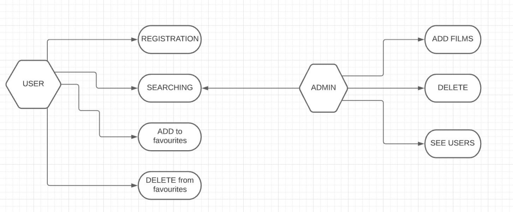
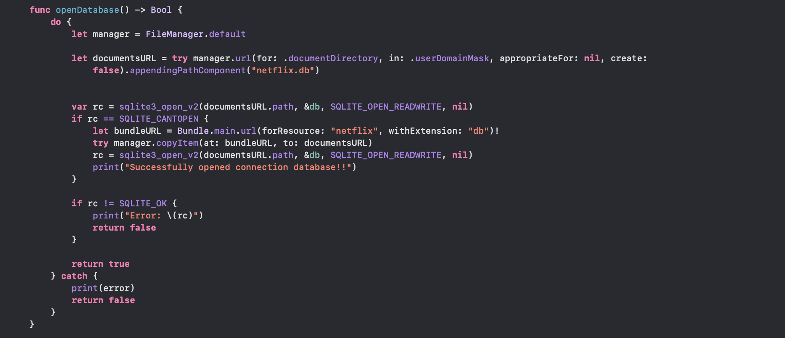

# Netflix TV-shows and Movies

Link for kaggle:
https://www.kaggle.com/shivamb/netflix-shows

# We choose this dataSet because:
1. It contain good information for Movies and TV-Shows
2. Contain more useful information than other dataSets
3. All information need for our project ( does not have not needed information )

# Question withc we will cover in this project:
1. What is the director of the TV Show or movie ?
2. What is the percentage of TV Show and Movie ?
3. What is the oldest or the newest TV Show or Movie in Netflix ?
4. Which country produced the most TV Shows and Movies?
5. Movie with the longest duration  ?
6. Which TV show was filmed in selected country?
7. Name of actors in Movie or TV shows ?
8. In which TV Shows or Movies participated selected actor ?
9. Which directors has the most products ?
10. Which TV Shows and movies are produced after specific date(For example: after 2019)
11. Number of TV shows ?
12. Number of Movies ?
13. Which ratings is most popular ?
14. In which year produced more films ?
15. Average duration of movies ?

# Features and functionalities:
1. User can see and analyze the films and tv shows
2. User can see actor's movies
3. User can movies director
4. User can see movies and TV-shows duration and release date
5. Can add to favourite
6. Can delete from favourite
7. User can registration

# UML use case diagram


# Connection To DateBase


# Script for phase 9
```python
import sqlite3
from sqlite3 import Error
import time

def openConnection(_dbFile):
    print("++++++++++++++++++++++++++++++++++")
    print("Open database: ", _dbFile)
    conn = None
    try:
        conn = sqlite3.connect(_dbFile)
        print("success")
    except Error as e:
        print(e)
    print("++++++++++++++++++++++++++++++++++")
    return conn

def closeConnection(_conn, _dbFile):
    print("++++++++++++++++++++++++++++++++++")
    print("Close database: ", _dbFile)
    try:
        _conn.close()
        print("success")
    except Error as e:
        print(e)
    print("++++++++++++++++++++++++++++++++++")

def testQuery(_conn):
    print("++++++++++++++++++++++++++++++++++")
    print("\nPerformance measure: testQuery")
    start = time.time()
    try:
        sql = """ 
            select count(*) 
            from partsupp join (nation join supplier
                on n_nationkey = s_nationkey) on s_suppkey = ps_suppkey;
        """
        print(sql)
        cur = _conn.cursor()
        cur.execute(sql)
        rows = cur.fetchall()
        for row in rows:
            l = '\n\tRESULT: {}\n'.format(row[0])
            print(l)
    except Error as e:
        print(e)
    num=0
    for i in range(5):
        end = time.time()
        num+=(end - start)
        print(str(i)+"\nTIME FOR testQuery: " + str(end - start) + " seconds\n")
    print("++++++++++++++++++++++++++++++++++")
    print(num/5)

def main():
    database = r"tpch.sqlite"
    conn = openConnection(database)
    with conn:
        testQuery(conn)
    closeConnection(conn, database)

if name == '__main__':
    main()
```
